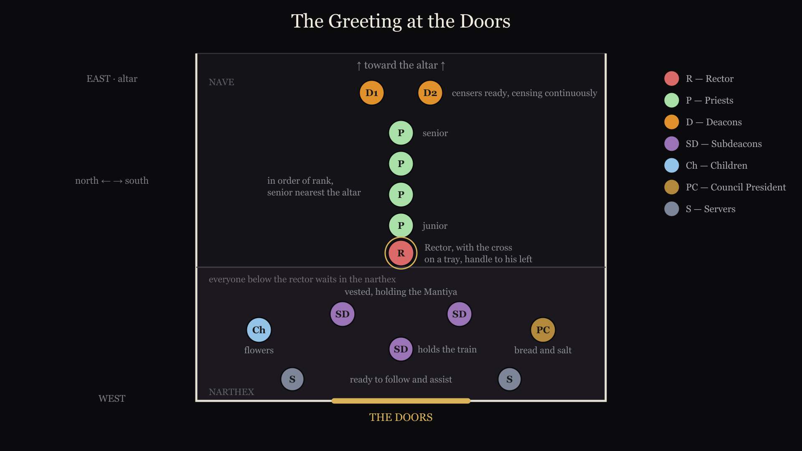
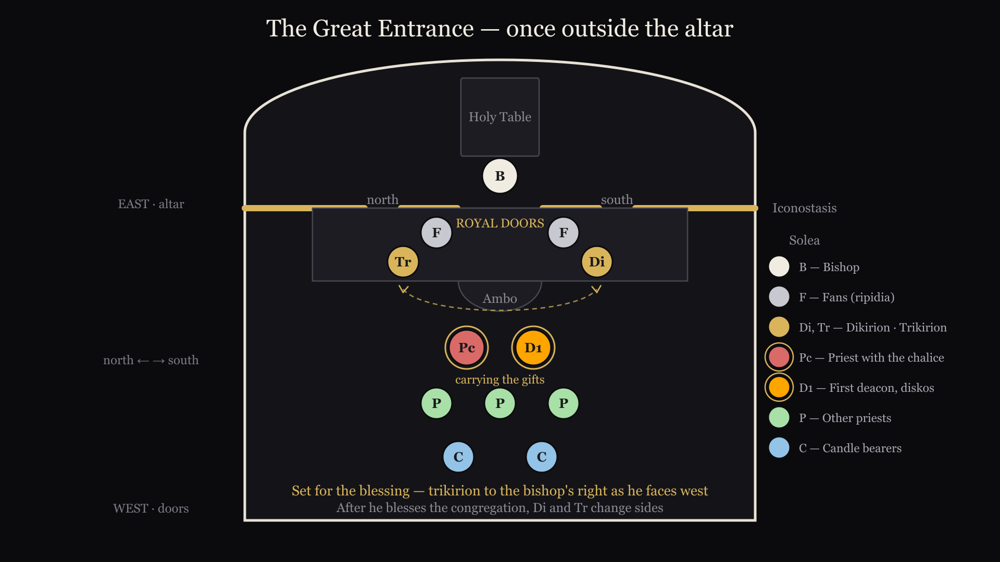

# Rubrics for Serving at a Hierarchical Liturgy

*For deacons, subdeacons and altar servers*

This assumes the parish Liturgy is already second nature — in the Russian recension a deacon serves it regularly. What follows focuses on what changes when the bishop serves.

`generated 25 Aug 2026, 01:56 · b9430a3`

OCA, Russian recension · Diocese of New York and New Jersey · Filmed 20 June 2026. Times are positions within each clip, so a direction here sits at the same moment in the footage.

---

## Contents

1. [Greeting of the Hierarch at the Doors](#greeting-of-the-hierarch-at-the-doors) · 0:00
2. [The Bishop Enters the Nave](#the-bishop-enters-the-nave) · 1:10
3. [Entrance Prayers](#entrance-prayers) · 2:35
4. [Preparing to Vest the Bishop](#preparing-to-vest-the-bishop) · 3:13
5. [Vesting the Bishop](#vesting-the-bishop) · 4:27
6. [The Blessing of the Dikiri and Trikiri](#the-blessing-of-the-dikiri-and-trikiri) · 6:15
7. [Final Prayers before the Liturgy](#final-prayers-before-the-liturgy) · 8:31
8. [Washing of the Hands](#washing-of-the-hands) · 10:10
9. [Completion of the Washing of Hands and the Second Litany](#completion-of-the-washing-of-hands-and-the-second-litany) · 11:36
10. [The Second Antiphon](#the-second-antiphon) · 12:16
11. [The Beginning of the Little Entrance](#the-beginning-of-the-little-entrance) · 12:48
12. [The Conclusion of the Little Entrance](#the-conclusion-of-the-little-entrance) · 14:08
14. [Hierarchical Censing After the Great Entrance](#hierarchical-censing-after-the-great-entrance) · 15:54
15. [Troparion, Kontakion, Save the Pious and the Thrice Holy](#troparion-kontakion-save-the-pious-and-the-thrice-holy) · 18:01
16. [Conclusion of Thrice Holy](#conclusion-of-thrice-holy) · 22:10
17. [Lesser Censing, and Epistle Reading](#lesser-censing-and-epistle-reading) · 23:08
18. [Alleluias and the Gospel Book Goes Out](#alleluias-and-the-gospel-book-goes-out) · 26:32
19. [Reading of the Gospel](#reading-of-the-gospel) · 27:30
20. [Gospel is Returned to the Altar](#gospel-is-returned-to-the-altar) · 28:41
21. [Augmented Litany Begins](#augmented-litany-begins) · 29:15
22. [Augmented Litany through censing before great entrance](#augmented-litany-through-censing-before-great-entrance) · 29:36
23. [Clergy Kissing the Bishops Shoulder](#clergy-kissing-the-bishops-shoulder) · 36:24
25. [The Bishop makes His Commemorations](#the-bishop-makes-his-commemorations) · 36:40
26. [Covering the Gifts and The Great Entrance](#covering-the-gifts-and-the-great-entrance) · 36:55
27. [Conclusion of the Great Entrance](#conclusion-of-the-great-entrance) · 41:13
28. [Litany of Supplication and the Creed](#litany-of-supplication-and-the-creed) · 41:59
29. [The anaphora part 1](#the-anaphora-part-1) · 42:30
30. [The anaphora part 2](#the-anaphora-part-2) · 44:51
31. [The anaphora part 3](#the-anaphora-part-3) · 46:33
32. [The anaphora part 4](#the-anaphora-part-4) · 47:42
34. [After Communion](#after-communion) · 51:51
35. [Litany of Thanksgiving](#litany-of-thanksgiving) · 53:30
36. [Final blessing and Many Years](#final-blessing-and-many-years) · 54:53
37. [Conclusion](#conclusion) · 59:06

---

> Hierarchical Divine Liturgy
> Recorded at NY&NJ Deacon Training
> 20 June 2026
>
> *Page references are from St. Tikhon's Hieratikon Vol 2, 2017*

---

## Greeting of the Hierarch at the Doors

*clip 1 · 1:27 · [0:00 in the video](https://youtu.be/aRs9oqKMCd8?t=0s)*

> Greeting of the Hierarch at the Doors
>
> Ready at the door should be 
> Children with flowers.
> Parish Council President — bread and salt.

Parish Council President should be prepared with Bread and salt

Children should come with flowers

Priest should be ready with a blessing cross on a tray with handle to the priest's left

Rector at center, other priests to south and north sides of the church

Other priests present should be lined up in order of rank inside the Nave

Deacons should be ready with censers behind the priests

Two vested servers should be ready at the doors with the Mantiya

One subdeacon or altar server holds the train of the Mantiya

Two additional servers should be in the narthex ready to follow and assist

**0:06** · **SUBDEACONS**

  Subdeacons place the Mantiya

**0:10** · **DEACONS**

  Continuously cense the Bishop

**0:14**

  Notice arrangement of priests in order of seniority with deacons behind them.

**1:22** · **PRIEST**

  At the conclusion, the priest presents the cross

---

## The Bishop Enters the Nave

*clip 2 · 1:20 · [1:10 in the video](https://youtu.be/aRs9oqKMCd8?t=71s)*

> The Bishop Greets the Clergy, and Enters the Nave

**0:01**

  The priests in order kiss the cross, and the Bishop's hand and receive the blessing,

**0:09**

  Then the presiding priest does the same, and is given back the cross on his tray

**0:16** · **FIRST DEACON**

  "Bless, master, the holy incense" - Both Deacons hold up their censers

**0:27** · **SECOND DEACON**

  Wisdom!

**0:30**

  Deacons turn around and walk forward toward cathedra

**0:34** · **CHOIR**

  While the first deacon, chants and the choir sings - "it is truly meet…"

**0:42**

  Deacons walk past cathedra, turn around and continue to cense the Bishop

**0:56** · **SERVERS**

  Deacons turn towards the altar, as Bishop walks past, giving their censers away

**1:00** · **SERVERS**

  The server holding the train takes the staff, and the Bishop will greet the icons

**1:04** · **SERVERS**

  The two servers holding the censers return them to the altar

---

## Entrance Prayers

*clip 3 · 2:44 · [2:35 in the video](https://youtu.be/aRs9oqKMCd8?t=155s)*

> Entrance Prayers

**0:15** · **FIRST DEACON**

  reads the entrance prayers quietly,
  As normal, BUT stops before "I will enter thy house"

---

## Preparing to Vest the Bishop

*clip 4 · 2:10 · [3:13 in the video](https://youtu.be/aRs9oqKMCd8?t=193s)*

> Preparing to Vest the Bishop

**1:05** · **FIRST DEACON**

  Ton Despótēn kaì Archiaréa hēmōn, Kýrie phýlatte: eis pollà étē, Déspota!

**1:09**

  Pronunciation: 
  ton thes-PO-teen keh ar-hee-eh-REH-ah ee-MON, 
  KEE-ree-eh FEE-lah-teh: ees poh-LAH EH-tee, THES-poh-tah!

**1:50** · **SERVERS**

  have censers ready at both deacon's doors

**1:54** · **DEACONS**

  retrieve loaded censers from north and south doors

---

## Vesting the Bishop

*clip 5 · 1:28 · [4:27 in the video](https://youtu.be/aRs9oqKMCd8?t=267s)*

> Vesting the Bishop
>
> All vestments, and other articles must have been 
> prepared and neatly stacked.
> A tray should be ready to receive the Mantiya and Klobuk.
> These are ready in the sanctuary or on a table in the nave.
> Altar servers need to be assigned to carry these items.
> An altar server should be ready to receive the staff, 
> as the senior servers will now help with the vesting.

**0:00** · **SERVERS**

  A junior server takes the staff, and the Mantiya is removed

**0:04** · **SUBDEACONS**

  The Bishop takes off his Klobuk and hands to the subdeacons, who place it on the tray.

**0:15** · **SUBDEACONS**

  The Bishop removes his cross, and Encolpion, and other items

**0:19** · **SERVERS**

  MEANWHILE: The vestments are brought from their location to the Bishop

**0:25** · **SUBDEACONS**

  The Bishop removes his riassa, and its placed with the rest of the items

**0:33** · **SERVERS**

  The items are taken back to the sanctuary

**0:36** · **DEACONS**

  The deacons raise their censers for the blessing

**0:50** · **DEACONS**

  Before each item is readied, the second deacon says: Let us pray to the Lord!
  Then the first deacon chants the appropriate prayer for that item.

**1:05** · **DEACONS**

  During the vesting the deacons continuously cense the Bishop.

---

## The Blessing of the Dikiri and Trikiri

*clip 6 · 2:10 · [6:15 in the video](https://youtu.be/aRs9oqKMCd8?t=376s)*

> The Blessing of the Dikiri and Trikiri
> ***
> As the cross and Encolpion are placed,
> the Dikiri and Trikiri are brought from the altar,
> followed by the clergy.

**0:00** · **SUBDEACONS**

  Dikiri on bishops *left* (left is less), 
  Trikiri on the *right* (more candles, more letters in *right*)

**0:46** · **DEACONS**

  At the last Amen, rapidly cense the Bishop

**1:24** · **SUBDEACONS**

  take the Dikiri and Trikiri (kissing the hand) and go to the iconostasis

**1:29** · **DEACONS**

  as the Bishop blesses the deacons they cense him *nine* times

**1:40** · **SUBDEACONS, DEACONS**

  The two subdeacons, and deacons turn and reverence the altar, 
  then turn and reverence the Bishop.

**1:49**

  the subdeacons and servers take the Dikiri, Trikiri and censers to the altar

**1:53** · **DEACONS**

  while the deacons stand in front and to the side of the Bishop,
  bowing first to the altar, then to the Bishop

---

## Final Prayers before the Liturgy

*clip 7 · 1:31 · [8:31 in the video](https://youtu.be/aRs9oqKMCd8?t=512s)*

> Final Prayers before the Liturgy
>
> These are the same prayers said by the priest at the altar,
> but here they are said in front of the Ambo
> (see pg 87)

**0:26** · **FIRST DEACON**

  *It is time for the Lord to act*
  etc, just the same as at the beginning of the Liturgy

**0:32** · **FIRST DEACON**

  *pray for me reverend master*
  and receive the blessing

**0:35** · **SECOND DEACON**

  also receives a blessing and stands behind the Bishop on his left.

**0:38** · **FIRST DEACON**

  stands before the icon of Christ at the iconostasis

**0:52** · **FIRST DEACON**

  along with those at the altar, bow to the high place, then to the Bishop
  and the liturgy begins

**1:05** · **SERVERS**

  The Bishop's Hieratikon is brought out the north door, and the server stands
  with the first deacon for the blessing.

**1:16** · **FIRST DEACON**

  after *unto ages of ages...* turn around and again reverence the Bishop.
  **note: this is done before each litany by both deacons, remember get a blessing to proceed**

---

## Washing of the Hands

*clip 8 · 1:17 · [10:10 in the video](https://youtu.be/aRs9oqKMCd8?t=610s)*

> Washing of the Hands
>
> These are said by the first deacon during the singing of the first antiphon
> (see page 71)
> The second deacon moves into place for the second (little) litany

**0:00** · **SUBDEACON, SERVERS**

  As the final litany is chanted *commemorating our most holy...*
  Three servers come down in front of the Ambo
  Traditionally a young server carries the bowl, pitcher and towel.

**0:08** · **SECOND DEACON**

  moves forward to stand before the Theotokos

---

## Completion of the Washing of Hands and the Second Litany

*clip 9 · 0:30 · [11:36 in the video](https://youtu.be/aRs9oqKMCd8?t=697s)*

> Completion of the Washing of Hands and the Second Litany
>
> The second deacon is now in place to chant the second litany.
> The first deacon moves behind and to the right of the Bishop.
> The servers return to the sanctuary

**0:00** · **SERVERS**

  At the conclusion of the washing of the hands, the servers return to sanctuary

**0:04** · **FIRST DEACON**

  moves behind and to the right of the Bishop

**0:15** · **SECOND DEACON**

  As the first antiphon concludes, bow to the icon, and then to the Bishop

---

## The Second Antiphon

*clip 10 · 0:21 · [12:16 in the video](https://youtu.be/aRs9oqKMCd8?t=737s)*

> The Second Antiphon
>
> At the conclusion of each litany the deacon also bows to the Bishop.
>
> As the second antiphon begins, the Hieratikon is brought to the Bishop.
>
> The third Litany is chanted as usual.

---

## The Beginning of the Little Entrance

*clip 11 · 1:05 · [12:48 in the video](https://youtu.be/aRs9oqKMCd8?t=768s)*

> The Beginning of the Little Entrance
>
> **The key is to organize the players before leaving the altar**
> - 1) junior servers with candles: they will end at the back
> - 2) then the Dikiri: it will end up at the bishops left
> - 3) then a fan: it will be between the Dikiri and the altar
> - 4) the **second** and (5) the first deacon: who will travel behind the Bishop
> the second deacon crosses over with the censer, between the fan and the altar
> the first deacon moves level with the second deacon carrying the Gospel
> - 6) then the second fan, which will be level with the other fan
> - 7) and finally the Trikiri

**0:00** · **SERVERS**

  Extra servers carrying candles come first

**0:02** · **SUBDEACON**

  the **Dikiri**

**0:04** · **SERVERS**

  the fan on the left

**0:06** · **SECOND DEACON**

  carrying the censer

**0:08** · **FIRST DEACON**

  carrying the Gospel

**0:11** · **SERVERS**

  the fan on the right

**0:13** · **SUBDEACON**

  the Trikiri

**0:16**

  the Dikiri and fan on the left are dropped off

**0:18**

  every one else moves behind the Bishop and to his right

**0:24**

  notice the censer is carried around to the Bishop's left

**0:28**

  everyone reverences the icons, and then the Bishop

**0:39**

  everyone is now facing each other with the Bishop at the center

---

## The Conclusion of the Little Entrance

*clip 12 · 1:40 · [14:08 in the video](https://youtu.be/aRs9oqKMCd8?t=848s)*

> The Conclusion of the Little Entrance
>
> Generally follows the rubrics on pages 97-99

> The Dikiri and Trikiri will be taken
> from the Bishop as he enters the royal doors.

**0:10** · **FIRST DEACON**

  *Bless Master the Holy Entrance* (p 98)

**0:16** · **FIRST DEACON**

  Presents the Gospel to Bishop to kiss.
  Be sure to hold it high enough for the Bishop.

**0:21** · **SUBDEACONS**

  Hand the Dikiri and Trikiri to the Bishop.
  And move just behind the first deacon.
  The second deacon continuously censes.
  While the fans cover the Gospel.

**1:10** · **DEACONS**

  with the censer leading, return to the sanctuary

**1:22** · **SUBDEACONS**

  The senior servers return to escort the Bishop to the Ambo,
  and return to the sanctuary, where they wait to take the
  Dikiri and Trikiri

---

## Hierarchical Censing After the Great Entrance

*clip 14 · 1:54 · [15:54 in the video](https://youtu.be/aRs9oqKMCd8?t=954s)*

> Hierarchical Censing After the Great Entrance
>
> The Bishop is given the Dikiri (left hand) and censer (right hand.)
> The first deacon will *lead* the Bishop in the censing carrying the Trikiri.
>
> The rubrics for the lesser censing are on page 38.

**1:43**

  The first deacon carries the Trikiri to the altar, 
  and is ready to receive the censer.
  A server takes the Dikiri, while the first deacon takes the censer.

---

## Troparion, Kontakion, Save the Pious and the Thrice Holy

*clip 15 · 3:58 · [18:01 in the video](https://youtu.be/aRs9oqKMCd8?t=1082s)*

> Troparion, Kontakion, Save the Pious and the Thrice Holy
>
> This follows the exact rubrics from page 101,
> including the first deacon's proclamation of 
> *O Lord, save the pious* which is often not said in
> parish practice.

**0:00**

  Ignore the many observing deacons

**0:04** · **SUBDEACONS**

  Dikiri on the **right**, Trikiri on the **left**.
  So that they are the bishops left and right hand as
  he faces the people.

**0:31** · **FIRST DEACON**

  As the choir sings *to ages of ages...*
  goes to the high place bows to the high 
  place and the Bishop.  *This is the normal practice and*
  *should always be done before any action by the deacon*

**0:44** · **SUBDEACONS**

  Note the position of Trikiri and Dikiri

**0:50** · **FIRST DEACON**

  Get the blessing from the Bishop and stand in front of Christ.

**1:13** · **FIRST DEACON**

  *Let us pray to the Lord* etc, following the full rubric on page 101

**1:27** · **FIRST DEACON**

  *O Lord, save the pious* is often translated in modern use as
  *O Lord, save those who fear thee*

**2:00** · **FIRST DEACON**

  After smoothly walking through the royal doors, go to the high place
  as usual, **and take the DIKIRI** to the Bishop

---

## Conclusion of Thrice Holy

*clip 16 · 1:17 · [22:10 in the video](https://youtu.be/aRs9oqKMCd8?t=1330s)*

> Conclusion of the Thrice Holy
>
> Rubrics are the same as page 102-103
> Second deacon will read the epistle

**1:05** · **SECOND DEACON**

  gets the blessing from the Bishop, and walks out the
  **royal doors** holding the epistle book high with the
  cross facing the people.

---

## Lesser Censing, and Epistle Reading

*clip 17 · 3:17 · [23:08 in the video](https://youtu.be/aRs9oqKMCd8?t=1389s)*

> Lesser Censing, and Epistle Reading

**0:00** · **SERVERS**

  bring the censer opened fully, and spoon of incense.
  Hand the censer to the first deacon and spoon to the Bishop.
  The first deacon will hold the censer and the Bishop will add the 
  incense.

**0:32** · **FIRST DEACON**

  *Let us attend!*, etc... per the normal liturgy, followed by 
  the lesser censing.

**1:00** · **SUBDEACONS**

  remove the Omophoron, and hand it to a server who will stand to the 
  side holding with the cross at the center

**1:42** · **FIRST DEACON**

  in best practice will finish censing the sanctuary and the doors
  and will wait at the royal doors till he announces the epistle
  before censing the iconostasis.

**2:18** · **FIRST DEACON**

  after censing the iconostasis, returns to cense the clergy as is
  normal, remembering to first cense the Bishop 9 times, then clergy
  from senior to junior, and south to north.

**2:38** · **FIRST DEACON**

  then censes the reader, the choir and the people as is normal.

**3:00** · **FIRST DEACON**

  finally censes Christ, Mary, and the altar as normal, and the
  Bishop (but only three times), bows to the high place, and the
  Bishop, and gives away the censer.

---

## Alleluias and the Gospel Book Goes Out

*clip 18 · 0:52 · [26:32 in the video](https://youtu.be/aRs9oqKMCd8?t=1592s)*

> Alleluias and the Gospel Book Goes Out

**0:00** · **SERVERS**

  Altar servers use both doors, 
  candle bearers first,
  then fans,
  then Dikiri and Trikiri.

**0:36** · **SERVERS**

  go out both doors, and wait at the Ambo
  for the Gospel

**0:48** · **FIRST DEACON**

  walk out the doors, as the Alleluias finish.
  Two deacons should cross beside each other.

---

## Reading of the Gospel

*clip 19 · 1:04 · [27:30 in the video](https://youtu.be/aRs9oqKMCd8?t=1650s)*

> Reading of the Gospel

**0:00** · **SECOND DEACON**

  enters through the royal doors after reading the epistle,
  and stands on the south side of the altar holding the
  epistle book up, as the Gospel is announced.

**0:12** · **SECOND DEACON**

  *Wisdom let us attend, let us listen to the Holy Gospel!*

**0:48** · **SECOND DEACON**

  *Let us attend!*

**0:52** · **SECOND DEACON**

  Kiss the altar, and then get a blessing from the Bishop,
  returning to his place at the altar.

**1:00** · **SERVER**

  presents Omophoron to the Bishop to kiss.

---

## Gospel is Returned to the Altar

*clip 20 · 0:28 · [28:41 in the video](https://youtu.be/aRs9oqKMCd8?t=1721s)*

> Gospel is Returned to the altar

**0:04** · **SUBDEACONS**

  upon returning to the Ambo hands the Trikiri and Dikiri
  to the Bishop, and waits for him to complete the blessing,
  then return them to the altar

**0:14** · **FIRST DEACON**

  unfolds the Eliton

**0:20** · **FIRST DEACON**

  unfolds the left and right sides of the Antimension,
  and kisses the altar

---

## Augmented Litany Begins

*clip 21 · 0:22 · [29:15 in the video](https://youtu.be/aRs9oqKMCd8?t=1756s)*

> The Second deacon Begins The Augmented Litany
> after the Sermon as usual

---

## Augmented Litany through censing before great entrance

*clip 22 · 7:10 · [29:36 in the video](https://youtu.be/aRs9oqKMCd8?t=1777s)*

> Augmented Litany through Censing before Great Entrance
>
> There are several important differences,
> so watch carefully.

**0:06** · **SUBDEACON**

  during the augmented litany,
  uncovers the gifts in preparation for the Bishop's
  commemorations.  Note the placement of the various
  cloths, and utensils.

**2:09** · **DEACONS**

  perform the full rubrics for dismissing the catechumens.
  (pg 113)

**2:30** · **FIRST DEACON**

  censes the sanctuary - altar, table of oblation, high place,
  the icons, Bishop (9x), the clergy and servers, then stops.

**4:12** · **SERVERS**

  bring out the pitcher of water, with a server having a towel
  on his shoulders, carrying the bowl.

**4:22** · **SUBDEACONS**

  prepare to hold the Omophoron above the Bishop during the 
  washing of the hands.  
  **Be sure the buttons are facing the Royal Doors**

**4:38** · **SUBDEACONS**

  raise the Omophoron after the Bishop has passed through the
  Royal Doors

**4:46**

  note: in some traditions the Bishop will sprinkle the water
  towards the congregation.  Wait a few seconds before
  presenting the towel.

**5:08** · **SUBDEACONS**

  reattach the Omophoron.

**5:24** · **DEACONS**

  follow the rubrics on pg 118 as normal:
  *That we may receive the King of all...* X 3

**6:02** · **SERVER**

  takes the Bishop's Miter.

**6:15** · **DEACONS**

  proceed to the table of oblation,
  the second deacon carrying a censer.

**6:20** · **SECOND DEACON**

  hands the censer to the Bishop,
  kissing His hand.

**6:31** · **SECOND DEACON**

  receives the censer back from the Bishop,
  kneels, and receives the Aer on his shoulder,
  and the censes the doors, the iconostasis,
  and the people.

---

## Clergy Kissing the Bishops Shoulder

*clip 23 · 0:09 · [36:24 in the video](https://youtu.be/aRs9oqKMCd8?t=2185s)*

> Clergy Kissing the Bishops Shoulder
>
> In order of rank the clergy and the servers 
> state their rank and name, and kiss the Bishop's
> shoulder.

---

## The Bishop makes His Commemorations

*clip 25 · 0:09 · [36:40 in the video](https://youtu.be/aRs9oqKMCd8?t=2201s)*

> The Bishop now  makes His Commemorations

**0:00** · **SECOND DEACON**

  remains at the Table of Oblation ready to
  complete the Proskomedia with the Bishop.

---

## Covering the Gifts and The Great Entrance

*clip 26 · 4:31 · [36:55 in the video](https://youtu.be/aRs9oqKMCd8?t=2216s)*

> Covering the Gifts and The Great Entrance

**0:00**

  At the Table of Oblation

**0:10** · **SECOND DEACON**

  holds the censer.  Notice how the censer is held:
  by the bottom, with the lid pulled away.

**0:18** · **SECOND DEACON**

  concludes the Proskomedia with the Bishop.
  (See pgs 82-85, the deacon's part should be memorized)

**1:16** · **SERVERS**

  carry (in order) the Miter and the Omophoron...

**1:22**

  the candles...

**1:24**

  the Dikiri...

**1:26**

  the censer (carried by the second deacon)...

**1:28**

  a fan...

**1:33**

  the Diskos (carried by the first deacon)...

**1:36**

  the Chalice...

**1:38**

  the second fan, and Trikiri...

**1:43**

  and other priests carrying crosses.

**1:47** · **SERVERS**

  have continued moving through the south deacon's doors,
  carrying the Omophoron and Miter

**1:53** · **SECOND DEACON**

  also has returned to the sanctuary through the Royal Doors
  and is at his side of the altar, with his censer.

**2:00**

  meanwhile on the Ambo the procession proceeds so that:
  fans are on either side of the Royal doors,
  Dikiri and Trikiri behind them (or if Ambo is narrow beside them)
  the first deacon and priest carrying the gifts at the foot of the Ambo,
  other priests behind them,
  and candle bearers behind them.
  **This will set things up for the following actions**

**2:31** · **SECOND DEACON**

  gives the censer to the Bishop.

**2:36** · **FIRST DEACON**

  moves the center of the royal doors, and kneels presenting the
  Diskos to the Bishop, who censes him.

**2:46** · **DEACONS**

  The second deacon takes the censer and the first deacon hands
  the Diskos to the Bishop.
  The first deacon returns to the altar, either through the royal 
  doors (if there is room) or through the south deacon's door.

**3:23**

  The priest carrying the chalice has presented it to the Bishop
  and again the second deacon will hand the censer to the Bishop
  and take it back.

**3:41** · **SECOND DEACON**

  now moves to the other side of the altar still holding the censer,
  and wearing the aer.

**3:51** · **SUBDEACONS**

  after the Bishop finishes blessing with the Dikiri and Trikiri and
  returns to the altar, the subdeacons cross the Ambo swapping places.

  This allows the Dikiri and Trikiri to return to the correct side
  of the altar.

**4:05**

  The following is a diagram of the where everyone should stand
  outside the sanctuary during the Great Entrance.

---

## Conclusion of the Great Entrance

*clip 27 · 0:30 · [41:13 in the video](https://youtu.be/aRs9oqKMCd8?t=2474s)*

> Conclusion of the Great Entrance
>
> Not shown:  The second deacon kneels to the Bishop and 
> the Aer is removed.  He rises and holds the censer as
> the Aer is censed, then the censer is given to the Bishop.

**0:00** · **SECOND DEACON**

  takes the censer back from the Bishop, goes the high place, 
  censes the Bishop 9 times, then bows to the high place.

**0:15** · **SUBDEACONS**

  have remained on the Ambo and will hand the Dikiri and Trikiri
  to the Bishop, and then after the blessing return them to the 
  Altar.

---

## Litany of Supplication and the Creed

*clip 28 · 2:41 · [41:59 in the video](https://youtu.be/aRs9oqKMCd8?t=2519s)*

> Litany of Supplication and the Creed
>
> For the Deacons and servers this follows
> the normal rubrics.

---

## The anaphora part 1

*clip 29 · 2:55 · [42:30 in the video](https://youtu.be/aRs9oqKMCd8?t=2550s)*

> The anaphora part 1

**0:00** · **SUBDEACONS**

  have brought the Trikiri and Dikiri to the corner of the altar
  during the creed...

**0:06**

  and hand them to the Bishop as the creed concludes.

**0:34**

  the first deacon returns to the sanctuary, and
  the subdeacons and deacons now stand together,
  at the high place

**1:18** · **SUBDEACONS**

  move back to be ready to receive the Trikiri and Dikiri
  as the choir sings *It is meet and right...* (pg 129)

**1:30**

  All will bow to the high place together, turn,
  and then the Dikiri and Trikiri are returned to their places

**1:42** · **SUBDEACONS**

  return to their places.  The second deacon will kiss
  the altar and hold the star as usual.

---

## The anaphora part 2

*clip 30 · 1:36 · [44:51 in the video](https://youtu.be/aRs9oqKMCd8?t=2691s)*

> The anaphora part 2: Words of Institution
>
> This follows the exact rubrics on pg 132,
> the first deacon raising the chalice.

---

## The anaphora part 3

*clip 31 · 1:04 · [46:33 in the video](https://youtu.be/aRs9oqKMCd8?t=2794s)*

> The anaphora part 3: Epiclesis
>
> Again this follows the exact rubrics on pg 134-135.

**0:04** · **FIRST DEACON**

  *Create in me a clean heart oh God, and renew a right Spirit within me!*

**0:14** · **SECOND DEACON**

  *Cast me not away from thy presence, and take not thy Holy Spirit from me!*

**0:42** · **FIRST DEACON**

  *Bless Master the Holy Bread*...*Bless Master the Holy Cup*...etc
  (all said by the first deacon pg 134)

---

## The anaphora part 4

*clip 32 · 2:44 · [47:42 in the video](https://youtu.be/aRs9oqKMCd8?t=2862s)*

> The anaphora part 4
>
> With the Bishop present additional prayers are said
> by the first deacon before the Lord's prayer.  
> These are not in the rubrics book!

**0:16** · **SECOND DEACON**

  takes the censer from the Bishop and continues to bless the 
  south, east, north, and west sides of the altar, and
  returning to the south-east corner, censes the Bishop 3 times.

**0:48** · **FIRST DEACON**

  while the hymn is being sung, goes to the high place,
  makes the usual reverences, and kissing the altar as 
  he passes, goes out through the Royal doors.

**0:56** · **CHOIR**

  singing... *without corruption thou gavest birth to God the*
  *Word: true Theotokos, we magnify thee.*

**1:07** · **FIRST DEACON**

  now says: *For All Mankind!*

**1:38**

  The following prayer and action begins as the priest concludes with
  the words *Among the first ... and rightly divides the word of thy truth!*

**1:58** · **FIRST DEACON**

  *For His Eminence, The Most Reverend Michael, Archbishop of*
  *New York, of the Diocese of New York, and New Jersey...*

**2:06** · **FIRST DEACON**

  *who here offers* -- and turning enters the sanctuary --
  *These Holy Gifts* -- pointing to the Diskos and Chalice

**2:09** · **FIRST DEACON**

  *Unto the Lord our God* -- after going to the high place 
  and reverencing the high place and the Bishop

**2:12** · **FIRST DEACON**

  *For the most blessed Tikhon, Archbishop of Washington*
  *Metropolitan of all America and Canada*

**2:18** · **FIRST DEACON**

  *For the holy synod of Bishops, the Most Reverend Metropolitans,* 
  *Archbishops and Bishops*

**2:25** · **FIRST DEACON**

  *For the honorable priesthood the diaconate in Christ*

**2:29** · **FIRST DEACON**

  Goes and stands again under the arch of he Royal doors, while saying:
  *For every priestly and monastic order.*

**2:35** · **FIRST DEACON**

  *For this land, its civil authorities and armed forces.*

**2:42** · **FIRST DEACON**

  *For peace of the whole world*
  *For the good estate of God's Holy Churches*

---

**0:00** · **FIRST DEACON**

  *For the salvation and assistance of all those*
  *who diligently labor and serve*

**0:08** · **FIRST DEACON**

  *For the healing of the sick, for the repose, pardon,*
  *blessed memory, and forgiveness of sins of all*
  *Orthodox who have fallen asleep.*

**0:20** · **FIRST DEACON**

  *For the salvation of all the people here present, and*
  *for those they have in mind.*

**0:28** · **FIRST DEACON**

  *And for all mankind!*

**0:35** · **FIRST DEACON**

  Returns to the high place, makes the usual reverences,
  and receives a blessing from the Bishop, kissing His
  hand and shoulder.

**1:00** · **SECOND DEACON**

  Goes out the south door, to give the litany before the
  Lords Prayer in the usual fashion (pgs 140-143)

## After Communion

*clip 34 · 1:22 · [51:51 in the video](https://youtu.be/aRs9oqKMCd8?t=3112s)*

> Holy Communion now proceeds in the usual fashion.
>
> The clergy in order of rank receive the body, 
> from the Bishop, stating their rank and name,
> and kissing the Bishops hand and shoulder.
>
> And again receiving the precious blood in the
> usual manner.

> The video continues after the clergy and faithful
> have received communion.

---

## Litany of Thanksgiving

*clip 35 · 1:17 · [53:30 in the video](https://youtu.be/aRs9oqKMCd8?t=3210s)*

> Litany of Thanksgiving

---

## Final blessing and Many Years

*clip 36 · 4:07 · [54:53 in the video](https://youtu.be/aRs9oqKMCd8?t=3293s)*

> Final blessing and Many Years

---

## Conclusion

*clip 37 · 0:21 · [59:06 in the video](https://youtu.be/aRs9oqKMCd8?t=3547s)*

> Conclusion

---
